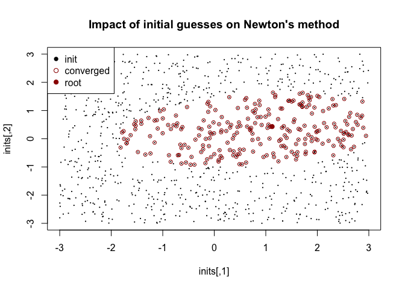
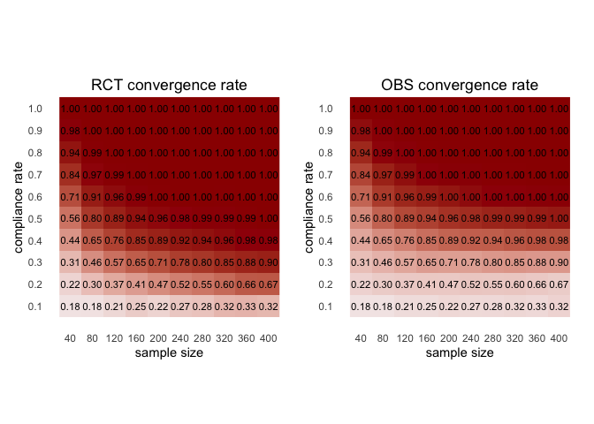
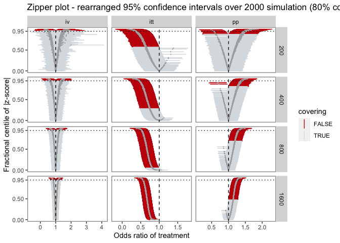

Instrumental variable estimation in the complier probabilistic index
model
================
Li Ge, Lu Mao.
2022-05-20


-   [2022 American Causal Inference Conference
    Abstract](#2022-american-causal-inference-conference-abstract)
-   [Simulation Analysis](#simulation-analysis)
    -   [Reproducibility](#reproducibility)
    -   [Convergence](#convergence)
        -   [Convergence Criteria](#convergence-criteria)
        -   [Empirical Convergence Rates](#empirical-convergence-rates)
-   [Summary Tables](#summary-tables)
    -   [RCT Tables](#rct-tables)
        -   [alpha](#alpha)
        -   [beta_1](#beta_1)
        -   [beta_2](#beta_2)
    -   [OBS Tables](#obs-tables)
        -   [alpha](#alpha-1)
        -   [beta_1](#beta_1-1)
        -   [beta_2](#beta_2-1)
-   [Visualization](#visualization)

<!-- README.md is generated from README.Rmd. Please edit that file -->

**Note**:

-   This `README.md` is generated from `README.Rmd`. Some of the source
    code is hidden in README.md for brevity. The reader can find all the
    code and details in `README.rmd`.
-   The tables and figures produced in this document might be **only
    aesthetically different** (e.g. style, color, font) from the ones
    that appear in the poster or manuscript.
-   We intentionally separated the analysis and implementation of the
    instrumental variable probabilistic index models (IVPIM) into
    different repositories. This repository contains scripts for
    conducting the simulation, output files, log files, analysis, and
    summary results.
-   [{complyr}](https://github.com/ge-li/complyr) implements the IVPIM
    method and has some generic data generating processes for studying
    non-compliance problems.
-   [{upim}](https://github.com/ge-li/upim) implements the U-statistics
    probabilistic index model.

## 2022 American Causal Inference Conference Abstract

<!-- badges: start -->
<!-- badges: end -->

**Title**: Instrumental variable estimation in the complier
probabilistic index model

**Authors**: Li Ge, Lu Mao

**Affiliation**: Department of Biostatistics and Medical Informatics,
University of Wisconsin-Madison

**Abstract**: Unignorable confounding is no stranger even for randomized
controlled trials (RCTs) in the presence of treatment non-compliance.
One fallback is the intention-to-treat (ITT) analysis, which
unfortunately only reflects the assignment-induced causal effect. The
celebrated (Angrist, Imbens & Rubin 1996) framework provides an
excellent platform to tackle this problem.

However, the local average treatment effect (LATE) is neither robust to
outliers nor suitable for categorical outcomes with vaguely defined
scales. The estimand targeted by the Mann-Whitney test is more
applicable in such scenarios. It measures the probability that the
outcome of a randomly selected treated subject is no worse than that in
control, which depends only on the rank of the outcome. (Thas et
al. 2012) introduced the probabilistic index model (PIM) to estimate the
covariate-adjusted conditional Mann-Whitney treatment effect. The
estimator arises naturally in a U-statistics form. (Mao 2018) derived
the semiparametric efficiency bounds for estimators of such type when
there is no unmeasured confounder. But estimating PIM with unignorable
confounding has not been adequately studied.

We propose the instrumental variable estimation in the complier PIM by a
generalized (Abadie 2003) weighting scheme to fill this gap. The
identification assumptions remain the same. We only impose a flexible
modeling assumption on compliers. The U-statistics M-estimator we
construct is asymptotically linear. We develop a user-friendly R package
for the method. Extensive simulation studies show the superiority of our
methods compared to ITT and per-protocol analysis under non-compliance.
When ethical or practical concerns prevent randomized trials, our
approach is still valid if the propensity score is properly estimated.
This work expands the toolbox for analyzing RCTs with non-compliance or
observational studies and is especially useful when outliers or ordinal
outcomes make ATE an inappropriate evaluation metric.

## Simulation Analysis

<!-- badges: start -->
<!-- badges: end -->

### Reproducibility

The simulation commands can be found in `sim_commands.txt`. The
simulation functions are implemented in `sim.R`. The command-line script
for running the simulation is `sim_script.R`. The output csv files are
in the `./out/` sub-directory, and the log files are in the `./log/`
sub-directory.

The output csv files are essentially data frames, where each row
contains the point estimates of the complier model coefficients and
their standard errors for each method in different combinations of
sample sizes and compliance rates.

The log file stores when the simulation starts and finishes, along with
the progress bar. After the progress bar for each simulation, the
indexes of non-convergent iterations and error messages are attached.

### Convergence

``` r
# get list of files
rct_files <- list.files("./out", pattern = "sim_type.rct", full.names = TRUE)
obs_files <- list.files("./out", pattern = "sim_type.obs", full.names = TRUE)

# read output files
rct_results <- do.call(rbind, lapply(rct_files, read.csv)) %>% tibble()
obs_results <- do.call(rbind, lapply(obs_files, read.csv)) %>% tibble()

# factorize method column
rct_results$method <- factor(rct_results$method, levels = c("iv", "itt", "pp"))
obs_results$method <- factor(obs_results$method,
                             levels = c("iv-correct", "iv-misspecified",
                                        "iv-marginal", "pp"))
```

The following code extract the number of convergent cases for each
setting. We can see that in the RCT simulation, the setting with

dropped 10 non-convergent iterations. Similarly when neither the sample
size or the compliance rate is high enough, there are some
non-convergent iterations in the observation study setting.

``` r
rct_n_conv <- rct_results %>%
  group_by(n_obs, p_c) %>%
  summarise(n_conv = n() / 3, .groups = "drop") # three methods per iteration
obs_n_conv <- obs_results %>%
  group_by(n_obs, p_c) %>%
  summarise(n_conv = n() / 4, .groups = "drop") # four methods per iteration
xtabs(n_conv ~ n_obs + p_c, rct_n_conv)
#>       p_c
#> n_obs   0.6  0.8    1
#>   200  1990 2000 2000
#>   400  2000 2000 2000
#>   800  2000 2000 2000
#>   1600 2000 2000 2000
xtabs(n_conv ~ n_obs + p_c, obs_n_conv)
#>       p_c
#> n_obs   0.6  0.8    1
#>   200  1853 1993 2000
#>   400  1973 2000 2000
#>   800  1999 2000 2000
#>   1600 2000 2000 2000
```

#### Convergence Criteria

For each combination of

and
,
we repeatedly generate

data. For all methods we are trying to compare, the imaginary analyst
would only have access to
.

Each method is some version of PIM, when solving the estimating
equations, we use the same Newton’s method setting:

1.  We use a pure Newton’s method with 100 maximum iterations. We don’t
    use global strategies (e.g., line search or trust-region methods) in
    this simulation. But the users will have the option to both print
    iteration reports and test different global strategies in
    `upim::pim_fit()` and `complyr::ivpim()`.
2.  The default initial guess is `jitter(rep(0, p))`, where p is the
    number of covariates in PIM. The `jitter()` function is to avoid
    using all zeros as an initial guess and accidentally set estimating
    function to be within function value tolerance.

We use the same convergence criteria:

1.  We use the L-infinity norm to check whether a root for estimating
    equation is found. The tolerance is set to be
    `sqrt(.Machine$double.eps) = 1.49e-8`. This is also the default
    tolerance for `all.equal()` function in R.
2.  We check whether the Jacobian is invertible using the same
    tolerance.
3.  We check the `nleqslv::nleqslv()` termination code for other
    non-convergent cases such as exceeding the maximum iteration.

To make the results comparable, we would only accept iterations where
all methods converged. For example, in the RCT simulation, per-protocol
PIM will only use a subset of per-protocol data and IV-PIM will have
negative weights that affect the geometry of estimating function. In the
observational study simulation, sometimes the method that uses correct
propensity score estimation will converge but the one that uses a
misspecified or marginal propensity score model will fail to converge.
We only keep iteration that all methods declare convergence.

The log files show that almost all non-convergent cases are directly due
to the singular Jacobian matrix of the estimating function. However, the
root causes are generally due to:

1.  The estimating function has no “zeros” within function tolerance
    (1.49e-8). This is usually due to the presence of a high
    non-compliance rate in small sample sizes, which makes the
    estimating function irregular. IV methods are not “silver bullets”
    for data quality problems in practice.
2.  The initial guess of Newton’s method is not ideal, with multiple
    covariates, we are essentially trying to solve a system of nonlinear
    equations. One of the conditions for Newton’s method to converge is
    that the initial guess is “close enough” to the true roots. Here is
    an example.

``` r
# 1. Generate RCT data
set.seed(42)
df <- complyr::dgp_rct(n = 200, p_c = 0.6, alpha = 1, beta_1 = 0.5, error_dist = "gumbel")
# 2. Fit an IV-PIM model
ps_model <- glm(df$z ~ 1, family = binomial(link = "logit"), x = TRUE)
good_init <- complyr::ivpim(y = df$y, z = df$z, a = df$a, X = df[, c("x1")],
                            ps_model =  ps_model, link = "logit",
                            init = c(0, 0), trace = T)
#> **Showing nleqslv::nleqslv() iteration report**
#>   Columns:
#>   --------
#>   Jac - Jacobian type (reciprocal condition number); N: Newton Jacobian; B: Broyden updated matrix
#>   Lambda - Line search parameter
#>   Fnorm - Fnorm square of the euclidean norm of function values / 2
#>   Largest |f| - Infinity norm of f(x) at the current point
#> 
#>   Algorithm parameters
#>   --------------------
#>   Method: Newton  Global strategy: none
#>   Maximum stepsize = 1.79769e+308
#>   Scaling: fixed
#>   ftol = 1.49012e-08 xtol = 1.49012e-08 btol = 0.001 cndtol = 1.49012e-08
#> 
#>   Iteration report
#>   ----------------
#>   Iter         Jac   Lambda          Fnorm   Largest |f|
#>      0                        2.525176e-03  5.851409e-02
#>      1  N(2.1e-01)   1.0000   4.474021e-05  8.370205e-03
#>      2  N(1.9e-01)   1.0000   1.575308e-07  5.060901e-04
#>      3  N(1.9e-01)   1.0000   2.657390e-12  2.096573e-06
#>      4  N(1.9e-01)   1.0000   7.446197e-22  3.524924e-11
#> 
#>   Results:
#>   --------
#>   Convergence achieved: PIM estimating function value is within tolerance.
good_init$coef
#>        a        X 
#> 1.122837 0.431241
```

However, if we use different initial guesses, we might not be able to
achieve convergence, as illustrated by the following figure.

<!-- -->

When dealing with a particular dataset, the best shot is to try with
different initial guesses when the IVPIM cannot converge. The user is
also encouraged to use the option `test.nleqslv = TRUE` to test
different global strategies or increase `max.iter`. We generally don’t
recommend relaxing numerical tolerance because that would make the
fitted model less accurate.

#### Empirical Convergence Rates

The following figures show the empirical convergence rates of the
particular DGPs we designed in different sample sizes and with
compliance rates ranging from 0.1 to 1 (n_sim = 2000). The script for
this simulation is `conv_test.R`. The output file is
`out/ivpim_conv_rates.csv`. The log file is `out/ivpim_conv_rates.log`.

It’s important to realize that the following estimation only reflects
the convergence rate for the particular simulation data generating
processes we use. It’s also conservative because we only try a single
initial guess with a pure Newton’s method solver.

<!-- -->

The compliance rate is only one aspect in that the DGPs for compliers
and non-compliers, although very different, we don’t change that in the
simulation. The readers can imagine if the DGPs for compliers and
non-compliers are the same, it won’t pose too much of a challenge. But
if the DGPs for compliers and non-compliers are extremely different,
since you cannot distinguish compliers from non-compliers when they are
per-protocol, it would be hard for most models trying to “fit” the data.
The way complier and non-complier DGPs differ can be arbitrary, we
believe changing the compliance rate is a good proxy to demonstrate that
study design and data quality should always come first.

## Summary Tables

-   IV-PIM is the only method that can consistently estimate the
    complier PIM coefficients.
-   The empirical average of standard error estimator (SEE) is close to
    the empirical standard error of the estimator (SE) under large
    samples for all three methods due to the use of robust sandwich
    estimator.
-   Only IV-PIM achieved the nominal 95% coverage probability.

<!-- -->

    #> Warning: Predicate functions must be wrapped in `where()`.
    #> 
    #>   # Bad
    #>   data %>% select(is.numeric)
    #> 
    #>   # Good
    #>   data %>% select(where(is.numeric))
    #> 
    #> ℹ Please update your code.
    #> This message is displayed once per session.

### RCT Tables

#### alpha

<table class=" lightable-classic" style="font-family: &quot;Arial Narrow&quot;, &quot;Source Sans Pro&quot;, sans-serif; margin-left: auto; margin-right: auto;border-bottom: 0;">
<caption>
Simulation study on the estimation and inference of alpha in the
randomized controlled trial
</caption>
<thead>
<tr>
<th style="empty-cells: hide;" colspan="3">
</th>
<th style="padding-bottom:0; padding-left:3px;padding-right:3px;text-align: center; " colspan="4">

<div style="border-bottom: 1px solid #111111; margin-bottom: -1px; ">

Instrumental varible

</div>

</th>
<th style="padding-bottom:0; padding-left:3px;padding-right:3px;text-align: center; " colspan="4">

<div style="border-bottom: 1px solid #111111; margin-bottom: -1px; ">

Itention-to-treat

</div>

</th>
<th style="padding-bottom:0; padding-left:3px;padding-right:3px;text-align: center; " colspan="4">

<div style="border-bottom: 1px solid #111111; margin-bottom: -1px; ">

Per-protocol

</div>

</th>
</tr>
<tr>
<th style="text-align:right;">
p_c
</th>
<th style="text-align:right;">
n_obs
</th>
<th style="text-align:right;">
p_conv
</th>
<th style="text-align:right;">
Bias
</th>
<th style="text-align:right;">
SE
</th>
<th style="text-align:right;">
SEE
</th>
<th style="text-align:right;">
CP
</th>
<th style="text-align:right;">
Bias
</th>
<th style="text-align:right;">
SE
</th>
<th style="text-align:right;">
SEE
</th>
<th style="text-align:right;">
CP
</th>
<th style="text-align:right;">
Bias
</th>
<th style="text-align:right;">
SE
</th>
<th style="text-align:right;">
SEE
</th>
<th style="text-align:right;">
CP
</th>
</tr>
</thead>
<tbody>
<tr>
<td style="text-align:right;">
0.6
</td>
<td style="text-align:right;">
200
</td>
<td style="text-align:right;">
0.995
</td>
<td style="text-align:right;">
0.042
</td>
<td style="text-align:right;">
0.438
</td>
<td style="text-align:right;">
0.591
</td>
<td style="text-align:right;">
0.980
</td>
<td style="text-align:right;">
-0.551
</td>
<td style="text-align:right;">
0.176
</td>
<td style="text-align:right;">
0.174
</td>
<td style="text-align:right;">
0.125
</td>
<td style="text-align:right;">
0.335
</td>
<td style="text-align:right;">
0.220
</td>
<td style="text-align:right;">
0.214
</td>
<td style="text-align:right;">
0.651
</td>
</tr>
<tr>
<td style="text-align:right;">
0.6
</td>
<td style="text-align:right;">
400
</td>
<td style="text-align:right;">
1.000
</td>
<td style="text-align:right;">
0.022
</td>
<td style="text-align:right;">
0.261
</td>
<td style="text-align:right;">
0.259
</td>
<td style="text-align:right;">
0.964
</td>
<td style="text-align:right;">
-0.552
</td>
<td style="text-align:right;">
0.122
</td>
<td style="text-align:right;">
0.122
</td>
<td style="text-align:right;">
0.007
</td>
<td style="text-align:right;">
0.326
</td>
<td style="text-align:right;">
0.153
</td>
<td style="text-align:right;">
0.149
</td>
<td style="text-align:right;">
0.411
</td>
</tr>
<tr>
<td style="text-align:right;">
0.6
</td>
<td style="text-align:right;">
800
</td>
<td style="text-align:right;">
1.000
</td>
<td style="text-align:right;">
0.007
</td>
<td style="text-align:right;">
0.169
</td>
<td style="text-align:right;">
0.171
</td>
<td style="text-align:right;">
0.963
</td>
<td style="text-align:right;">
-0.556
</td>
<td style="text-align:right;">
0.086
</td>
<td style="text-align:right;">
0.086
</td>
<td style="text-align:right;">
0.000
</td>
<td style="text-align:right;">
0.315
</td>
<td style="text-align:right;">
0.105
</td>
<td style="text-align:right;">
0.105
</td>
<td style="text-align:right;">
0.138
</td>
</tr>
<tr>
<td style="text-align:right;">
0.6
</td>
<td style="text-align:right;">
1600
</td>
<td style="text-align:right;">
1.000
</td>
<td style="text-align:right;">
0.005
</td>
<td style="text-align:right;">
0.117
</td>
<td style="text-align:right;">
0.119
</td>
<td style="text-align:right;">
0.957
</td>
<td style="text-align:right;">
-0.558
</td>
<td style="text-align:right;">
0.061
</td>
<td style="text-align:right;">
0.061
</td>
<td style="text-align:right;">
0.000
</td>
<td style="text-align:right;">
0.315
</td>
<td style="text-align:right;">
0.073
</td>
<td style="text-align:right;">
0.074
</td>
<td style="text-align:right;">
0.009
</td>
</tr>
<tr>
<td style="text-align:right;">
0.8
</td>
<td style="text-align:right;">
200
</td>
<td style="text-align:right;">
1.000
</td>
<td style="text-align:right;">
0.023
</td>
<td style="text-align:right;">
0.266
</td>
<td style="text-align:right;">
0.260
</td>
<td style="text-align:right;">
0.959
</td>
<td style="text-align:right;">
-0.323
</td>
<td style="text-align:right;">
0.185
</td>
<td style="text-align:right;">
0.182
</td>
<td style="text-align:right;">
0.566
</td>
<td style="text-align:right;">
0.159
</td>
<td style="text-align:right;">
0.206
</td>
<td style="text-align:right;">
0.199
</td>
<td style="text-align:right;">
0.876
</td>
</tr>
<tr>
<td style="text-align:right;">
0.8
</td>
<td style="text-align:right;">
400
</td>
<td style="text-align:right;">
1.000
</td>
<td style="text-align:right;">
0.014
</td>
<td style="text-align:right;">
0.181
</td>
<td style="text-align:right;">
0.176
</td>
<td style="text-align:right;">
0.952
</td>
<td style="text-align:right;">
-0.326
</td>
<td style="text-align:right;">
0.130
</td>
<td style="text-align:right;">
0.128
</td>
<td style="text-align:right;">
0.284
</td>
<td style="text-align:right;">
0.149
</td>
<td style="text-align:right;">
0.143
</td>
<td style="text-align:right;">
0.139
</td>
<td style="text-align:right;">
0.813
</td>
</tr>
<tr>
<td style="text-align:right;">
0.8
</td>
<td style="text-align:right;">
800
</td>
<td style="text-align:right;">
1.000
</td>
<td style="text-align:right;">
0.006
</td>
<td style="text-align:right;">
0.122
</td>
<td style="text-align:right;">
0.122
</td>
<td style="text-align:right;">
0.956
</td>
<td style="text-align:right;">
-0.331
</td>
<td style="text-align:right;">
0.089
</td>
<td style="text-align:right;">
0.090
</td>
<td style="text-align:right;">
0.046
</td>
<td style="text-align:right;">
0.143
</td>
<td style="text-align:right;">
0.098
</td>
<td style="text-align:right;">
0.098
</td>
<td style="text-align:right;">
0.693
</td>
</tr>
<tr>
<td style="text-align:right;">
0.8
</td>
<td style="text-align:right;">
1600
</td>
<td style="text-align:right;">
1.000
</td>
<td style="text-align:right;">
0.002
</td>
<td style="text-align:right;">
0.088
</td>
<td style="text-align:right;">
0.086
</td>
<td style="text-align:right;">
0.947
</td>
<td style="text-align:right;">
-0.332
</td>
<td style="text-align:right;">
0.064
</td>
<td style="text-align:right;">
0.063
</td>
<td style="text-align:right;">
0.001
</td>
<td style="text-align:right;">
0.140
</td>
<td style="text-align:right;">
0.071
</td>
<td style="text-align:right;">
0.069
</td>
<td style="text-align:right;">
0.470
</td>
</tr>
<tr>
<td style="text-align:right;">
1.0
</td>
<td style="text-align:right;">
200
</td>
<td style="text-align:right;">
1.000
</td>
<td style="text-align:right;">
0.015
</td>
<td style="text-align:right;">
0.197
</td>
<td style="text-align:right;">
0.191
</td>
<td style="text-align:right;">
0.945
</td>
<td style="text-align:right;">
0.015
</td>
<td style="text-align:right;">
0.197
</td>
<td style="text-align:right;">
0.191
</td>
<td style="text-align:right;">
0.945
</td>
<td style="text-align:right;">
0.015
</td>
<td style="text-align:right;">
0.197
</td>
<td style="text-align:right;">
0.191
</td>
<td style="text-align:right;">
0.945
</td>
</tr>
<tr>
<td style="text-align:right;">
1.0
</td>
<td style="text-align:right;">
400
</td>
<td style="text-align:right;">
1.000
</td>
<td style="text-align:right;">
0.010
</td>
<td style="text-align:right;">
0.136
</td>
<td style="text-align:right;">
0.133
</td>
<td style="text-align:right;">
0.947
</td>
<td style="text-align:right;">
0.010
</td>
<td style="text-align:right;">
0.136
</td>
<td style="text-align:right;">
0.133
</td>
<td style="text-align:right;">
0.947
</td>
<td style="text-align:right;">
0.010
</td>
<td style="text-align:right;">
0.136
</td>
<td style="text-align:right;">
0.133
</td>
<td style="text-align:right;">
0.947
</td>
</tr>
<tr>
<td style="text-align:right;">
1.0
</td>
<td style="text-align:right;">
800
</td>
<td style="text-align:right;">
1.000
</td>
<td style="text-align:right;">
0.004
</td>
<td style="text-align:right;">
0.094
</td>
<td style="text-align:right;">
0.094
</td>
<td style="text-align:right;">
0.950
</td>
<td style="text-align:right;">
0.004
</td>
<td style="text-align:right;">
0.094
</td>
<td style="text-align:right;">
0.094
</td>
<td style="text-align:right;">
0.950
</td>
<td style="text-align:right;">
0.004
</td>
<td style="text-align:right;">
0.094
</td>
<td style="text-align:right;">
0.094
</td>
<td style="text-align:right;">
0.950
</td>
</tr>
<tr>
<td style="text-align:right;">
1.0
</td>
<td style="text-align:right;">
1600
</td>
<td style="text-align:right;">
1.000
</td>
<td style="text-align:right;">
0.002
</td>
<td style="text-align:right;">
0.067
</td>
<td style="text-align:right;">
0.066
</td>
<td style="text-align:right;">
0.949
</td>
<td style="text-align:right;">
0.002
</td>
<td style="text-align:right;">
0.067
</td>
<td style="text-align:right;">
0.066
</td>
<td style="text-align:right;">
0.949
</td>
<td style="text-align:right;">
0.002
</td>
<td style="text-align:right;">
0.067
</td>
<td style="text-align:right;">
0.066
</td>
<td style="text-align:right;">
0.949
</td>
</tr>
</tbody>
<tfoot>
<tr>
<td style="padding: 0; " colspan="100%">
<span style="font-style: italic;">Note: </span>
</td>
</tr>
<tr>
<td style="padding: 0; " colspan="100%">
<sup></sup> SE, empirical standard error of the estimator; <br> SEE,
empirical average of the standard error estimator; <br> CP, empirical
coverage rate of the 95% confidence interval. <br> Each entry is based
on 2,000 replicates.
</td>
</tr>
</tfoot>
</table>

#### beta_1

<table class=" lightable-classic" style="font-family: &quot;Arial Narrow&quot;, &quot;Source Sans Pro&quot;, sans-serif; margin-left: auto; margin-right: auto;border-bottom: 0;">
<caption>
Simulation study on the estimation and inference of beta_1 in the
randomized controlled trial
</caption>
<thead>
<tr>
<th style="empty-cells: hide;" colspan="3">
</th>
<th style="padding-bottom:0; padding-left:3px;padding-right:3px;text-align: center; " colspan="4">

<div style="border-bottom: 1px solid #111111; margin-bottom: -1px; ">

Instrumental varible

</div>

</th>
<th style="padding-bottom:0; padding-left:3px;padding-right:3px;text-align: center; " colspan="4">

<div style="border-bottom: 1px solid #111111; margin-bottom: -1px; ">

Itention-to-treat

</div>

</th>
<th style="padding-bottom:0; padding-left:3px;padding-right:3px;text-align: center; " colspan="4">

<div style="border-bottom: 1px solid #111111; margin-bottom: -1px; ">

Per-protocol

</div>

</th>
</tr>
<tr>
<th style="text-align:right;">
p_c
</th>
<th style="text-align:right;">
n_obs
</th>
<th style="text-align:right;">
p_conv
</th>
<th style="text-align:right;">
Bias
</th>
<th style="text-align:right;">
SE
</th>
<th style="text-align:right;">
SEE
</th>
<th style="text-align:right;">
CP
</th>
<th style="text-align:right;">
Bias
</th>
<th style="text-align:right;">
SE
</th>
<th style="text-align:right;">
SEE
</th>
<th style="text-align:right;">
CP
</th>
<th style="text-align:right;">
Bias
</th>
<th style="text-align:right;">
SE
</th>
<th style="text-align:right;">
SEE
</th>
<th style="text-align:right;">
CP
</th>
</tr>
</thead>
<tbody>
<tr>
<td style="text-align:right;">
0.6
</td>
<td style="text-align:right;">
200
</td>
<td style="text-align:right;">
0.995
</td>
<td style="text-align:right;">
0.099
</td>
<td style="text-align:right;">
0.499
</td>
<td style="text-align:right;">
0.872
</td>
<td style="text-align:right;">
0.966
</td>
<td style="text-align:right;">
-0.280
</td>
<td style="text-align:right;">
0.092
</td>
<td style="text-align:right;">
0.090
</td>
<td style="text-align:right;">
0.130
</td>
<td style="text-align:right;">
-0.155
</td>
<td style="text-align:right;">
0.107
</td>
<td style="text-align:right;">
0.106
</td>
<td style="text-align:right;">
0.681
</td>
</tr>
<tr>
<td style="text-align:right;">
0.6
</td>
<td style="text-align:right;">
400
</td>
<td style="text-align:right;">
1.000
</td>
<td style="text-align:right;">
0.031
</td>
<td style="text-align:right;">
0.189
</td>
<td style="text-align:right;">
0.187
</td>
<td style="text-align:right;">
0.959
</td>
<td style="text-align:right;">
-0.281
</td>
<td style="text-align:right;">
0.064
</td>
<td style="text-align:right;">
0.063
</td>
<td style="text-align:right;">
0.009
</td>
<td style="text-align:right;">
-0.158
</td>
<td style="text-align:right;">
0.075
</td>
<td style="text-align:right;">
0.075
</td>
<td style="text-align:right;">
0.426
</td>
</tr>
<tr>
<td style="text-align:right;">
0.6
</td>
<td style="text-align:right;">
800
</td>
<td style="text-align:right;">
1.000
</td>
<td style="text-align:right;">
0.015
</td>
<td style="text-align:right;">
0.120
</td>
<td style="text-align:right;">
0.118
</td>
<td style="text-align:right;">
0.962
</td>
<td style="text-align:right;">
-0.281
</td>
<td style="text-align:right;">
0.045
</td>
<td style="text-align:right;">
0.044
</td>
<td style="text-align:right;">
0.000
</td>
<td style="text-align:right;">
-0.159
</td>
<td style="text-align:right;">
0.053
</td>
<td style="text-align:right;">
0.053
</td>
<td style="text-align:right;">
0.145
</td>
</tr>
<tr>
<td style="text-align:right;">
0.6
</td>
<td style="text-align:right;">
1600
</td>
<td style="text-align:right;">
1.000
</td>
<td style="text-align:right;">
0.006
</td>
<td style="text-align:right;">
0.077
</td>
<td style="text-align:right;">
0.080
</td>
<td style="text-align:right;">
0.964
</td>
<td style="text-align:right;">
-0.282
</td>
<td style="text-align:right;">
0.031
</td>
<td style="text-align:right;">
0.031
</td>
<td style="text-align:right;">
0.000
</td>
<td style="text-align:right;">
-0.160
</td>
<td style="text-align:right;">
0.036
</td>
<td style="text-align:right;">
0.037
</td>
<td style="text-align:right;">
0.009
</td>
</tr>
<tr>
<td style="text-align:right;">
0.8
</td>
<td style="text-align:right;">
200
</td>
<td style="text-align:right;">
1.000
</td>
<td style="text-align:right;">
0.025
</td>
<td style="text-align:right;">
0.167
</td>
<td style="text-align:right;">
0.164
</td>
<td style="text-align:right;">
0.965
</td>
<td style="text-align:right;">
-0.164
</td>
<td style="text-align:right;">
0.097
</td>
<td style="text-align:right;">
0.093
</td>
<td style="text-align:right;">
0.574
</td>
<td style="text-align:right;">
-0.073
</td>
<td style="text-align:right;">
0.103
</td>
<td style="text-align:right;">
0.101
</td>
<td style="text-align:right;">
0.879
</td>
</tr>
<tr>
<td style="text-align:right;">
0.8
</td>
<td style="text-align:right;">
400
</td>
<td style="text-align:right;">
1.000
</td>
<td style="text-align:right;">
0.011
</td>
<td style="text-align:right;">
0.108
</td>
<td style="text-align:right;">
0.108
</td>
<td style="text-align:right;">
0.960
</td>
<td style="text-align:right;">
-0.167
</td>
<td style="text-align:right;">
0.069
</td>
<td style="text-align:right;">
0.066
</td>
<td style="text-align:right;">
0.292
</td>
<td style="text-align:right;">
-0.076
</td>
<td style="text-align:right;">
0.073
</td>
<td style="text-align:right;">
0.071
</td>
<td style="text-align:right;">
0.800
</td>
</tr>
<tr>
<td style="text-align:right;">
0.8
</td>
<td style="text-align:right;">
800
</td>
<td style="text-align:right;">
1.000
</td>
<td style="text-align:right;">
0.005
</td>
<td style="text-align:right;">
0.076
</td>
<td style="text-align:right;">
0.074
</td>
<td style="text-align:right;">
0.942
</td>
<td style="text-align:right;">
-0.167
</td>
<td style="text-align:right;">
0.047
</td>
<td style="text-align:right;">
0.046
</td>
<td style="text-align:right;">
0.058
</td>
<td style="text-align:right;">
-0.077
</td>
<td style="text-align:right;">
0.050
</td>
<td style="text-align:right;">
0.050
</td>
<td style="text-align:right;">
0.653
</td>
</tr>
<tr>
<td style="text-align:right;">
0.8
</td>
<td style="text-align:right;">
1600
</td>
<td style="text-align:right;">
1.000
</td>
<td style="text-align:right;">
0.001
</td>
<td style="text-align:right;">
0.051
</td>
<td style="text-align:right;">
0.051
</td>
<td style="text-align:right;">
0.958
</td>
<td style="text-align:right;">
-0.167
</td>
<td style="text-align:right;">
0.033
</td>
<td style="text-align:right;">
0.033
</td>
<td style="text-align:right;">
0.002
</td>
<td style="text-align:right;">
-0.078
</td>
<td style="text-align:right;">
0.036
</td>
<td style="text-align:right;">
0.035
</td>
<td style="text-align:right;">
0.394
</td>
</tr>
<tr>
<td style="text-align:right;">
1.0
</td>
<td style="text-align:right;">
200
</td>
<td style="text-align:right;">
1.000
</td>
<td style="text-align:right;">
0.007
</td>
<td style="text-align:right;">
0.098
</td>
<td style="text-align:right;">
0.096
</td>
<td style="text-align:right;">
0.944
</td>
<td style="text-align:right;">
0.007
</td>
<td style="text-align:right;">
0.098
</td>
<td style="text-align:right;">
0.096
</td>
<td style="text-align:right;">
0.944
</td>
<td style="text-align:right;">
0.007
</td>
<td style="text-align:right;">
0.098
</td>
<td style="text-align:right;">
0.096
</td>
<td style="text-align:right;">
0.944
</td>
</tr>
<tr>
<td style="text-align:right;">
1.0
</td>
<td style="text-align:right;">
400
</td>
<td style="text-align:right;">
1.000
</td>
<td style="text-align:right;">
0.003
</td>
<td style="text-align:right;">
0.068
</td>
<td style="text-align:right;">
0.068
</td>
<td style="text-align:right;">
0.951
</td>
<td style="text-align:right;">
0.003
</td>
<td style="text-align:right;">
0.068
</td>
<td style="text-align:right;">
0.068
</td>
<td style="text-align:right;">
0.951
</td>
<td style="text-align:right;">
0.003
</td>
<td style="text-align:right;">
0.068
</td>
<td style="text-align:right;">
0.068
</td>
<td style="text-align:right;">
0.951
</td>
</tr>
<tr>
<td style="text-align:right;">
1.0
</td>
<td style="text-align:right;">
800
</td>
<td style="text-align:right;">
1.000
</td>
<td style="text-align:right;">
0.001
</td>
<td style="text-align:right;">
0.048
</td>
<td style="text-align:right;">
0.048
</td>
<td style="text-align:right;">
0.951
</td>
<td style="text-align:right;">
0.001
</td>
<td style="text-align:right;">
0.048
</td>
<td style="text-align:right;">
0.048
</td>
<td style="text-align:right;">
0.951
</td>
<td style="text-align:right;">
0.001
</td>
<td style="text-align:right;">
0.048
</td>
<td style="text-align:right;">
0.048
</td>
<td style="text-align:right;">
0.951
</td>
</tr>
<tr>
<td style="text-align:right;">
1.0
</td>
<td style="text-align:right;">
1600
</td>
<td style="text-align:right;">
1.000
</td>
<td style="text-align:right;">
0.000
</td>
<td style="text-align:right;">
0.034
</td>
<td style="text-align:right;">
0.034
</td>
<td style="text-align:right;">
0.943
</td>
<td style="text-align:right;">
0.000
</td>
<td style="text-align:right;">
0.034
</td>
<td style="text-align:right;">
0.034
</td>
<td style="text-align:right;">
0.943
</td>
<td style="text-align:right;">
0.000
</td>
<td style="text-align:right;">
0.034
</td>
<td style="text-align:right;">
0.034
</td>
<td style="text-align:right;">
0.943
</td>
</tr>
</tbody>
<tfoot>
<tr>
<td style="padding: 0; " colspan="100%">
<span style="font-style: italic;">Note: </span>
</td>
</tr>
<tr>
<td style="padding: 0; " colspan="100%">
<sup></sup> SE, empirical standard error of the estimator; <br> SEE,
empirical average of the standard error estimator; <br> CP, empirical
coverage rate of the 95% confidence interval. <br> Each entry is based
on 2,000 replicates.
</td>
</tr>
</tfoot>
</table>

#### beta_2

<table class=" lightable-classic" style="font-family: &quot;Arial Narrow&quot;, &quot;Source Sans Pro&quot;, sans-serif; margin-left: auto; margin-right: auto;border-bottom: 0;">
<caption>
Simulation study on the estimation and inference of beta_2 in the
randomized controlled trial
</caption>
<thead>
<tr>
<th style="empty-cells: hide;" colspan="3">
</th>
<th style="padding-bottom:0; padding-left:3px;padding-right:3px;text-align: center; " colspan="4">

<div style="border-bottom: 1px solid #111111; margin-bottom: -1px; ">

Instrumental varible

</div>

</th>
<th style="padding-bottom:0; padding-left:3px;padding-right:3px;text-align: center; " colspan="4">

<div style="border-bottom: 1px solid #111111; margin-bottom: -1px; ">

Itention-to-treat

</div>

</th>
<th style="padding-bottom:0; padding-left:3px;padding-right:3px;text-align: center; " colspan="4">

<div style="border-bottom: 1px solid #111111; margin-bottom: -1px; ">

Per-protocol

</div>

</th>
</tr>
<tr>
<th style="text-align:right;">
p_c
</th>
<th style="text-align:right;">
n_obs
</th>
<th style="text-align:right;">
p_conv
</th>
<th style="text-align:right;">
Bias
</th>
<th style="text-align:right;">
SE
</th>
<th style="text-align:right;">
SEE
</th>
<th style="text-align:right;">
CP
</th>
<th style="text-align:right;">
Bias
</th>
<th style="text-align:right;">
SE
</th>
<th style="text-align:right;">
SEE
</th>
<th style="text-align:right;">
CP
</th>
<th style="text-align:right;">
Bias
</th>
<th style="text-align:right;">
SE
</th>
<th style="text-align:right;">
SEE
</th>
<th style="text-align:right;">
CP
</th>
</tr>
</thead>
<tbody>
<tr>
<td style="text-align:right;">
0.6
</td>
<td style="text-align:right;">
200
</td>
<td style="text-align:right;">
0.995
</td>
<td style="text-align:right;">
-0.139
</td>
<td style="text-align:right;">
0.606
</td>
<td style="text-align:right;">
1.006
</td>
<td style="text-align:right;">
0.959
</td>
<td style="text-align:right;">
0.386
</td>
<td style="text-align:right;">
0.094
</td>
<td style="text-align:right;">
0.094
</td>
<td style="text-align:right;">
0.027
</td>
<td style="text-align:right;">
0.214
</td>
<td style="text-align:right;">
0.115
</td>
<td style="text-align:right;">
0.113
</td>
<td style="text-align:right;">
0.507
</td>
</tr>
<tr>
<td style="text-align:right;">
0.6
</td>
<td style="text-align:right;">
400
</td>
<td style="text-align:right;">
1.000
</td>
<td style="text-align:right;">
-0.050
</td>
<td style="text-align:right;">
0.243
</td>
<td style="text-align:right;">
0.225
</td>
<td style="text-align:right;">
0.954
</td>
<td style="text-align:right;">
0.391
</td>
<td style="text-align:right;">
0.069
</td>
<td style="text-align:right;">
0.066
</td>
<td style="text-align:right;">
0.000
</td>
<td style="text-align:right;">
0.219
</td>
<td style="text-align:right;">
0.083
</td>
<td style="text-align:right;">
0.080
</td>
<td style="text-align:right;">
0.233
</td>
</tr>
<tr>
<td style="text-align:right;">
0.6
</td>
<td style="text-align:right;">
800
</td>
<td style="text-align:right;">
1.000
</td>
<td style="text-align:right;">
-0.018
</td>
<td style="text-align:right;">
0.144
</td>
<td style="text-align:right;">
0.139
</td>
<td style="text-align:right;">
0.959
</td>
<td style="text-align:right;">
0.393
</td>
<td style="text-align:right;">
0.047
</td>
<td style="text-align:right;">
0.047
</td>
<td style="text-align:right;">
0.000
</td>
<td style="text-align:right;">
0.223
</td>
<td style="text-align:right;">
0.056
</td>
<td style="text-align:right;">
0.056
</td>
<td style="text-align:right;">
0.024
</td>
</tr>
<tr>
<td style="text-align:right;">
0.6
</td>
<td style="text-align:right;">
1600
</td>
<td style="text-align:right;">
1.000
</td>
<td style="text-align:right;">
-0.012
</td>
<td style="text-align:right;">
0.095
</td>
<td style="text-align:right;">
0.094
</td>
<td style="text-align:right;">
0.953
</td>
<td style="text-align:right;">
0.394
</td>
<td style="text-align:right;">
0.033
</td>
<td style="text-align:right;">
0.033
</td>
<td style="text-align:right;">
0.000
</td>
<td style="text-align:right;">
0.222
</td>
<td style="text-align:right;">
0.040
</td>
<td style="text-align:right;">
0.040
</td>
<td style="text-align:right;">
0.000
</td>
</tr>
<tr>
<td style="text-align:right;">
0.8
</td>
<td style="text-align:right;">
200
</td>
<td style="text-align:right;">
1.000
</td>
<td style="text-align:right;">
-0.039
</td>
<td style="text-align:right;">
0.196
</td>
<td style="text-align:right;">
0.190
</td>
<td style="text-align:right;">
0.963
</td>
<td style="text-align:right;">
0.229
</td>
<td style="text-align:right;">
0.108
</td>
<td style="text-align:right;">
0.100
</td>
<td style="text-align:right;">
0.351
</td>
<td style="text-align:right;">
0.100
</td>
<td style="text-align:right;">
0.114
</td>
<td style="text-align:right;">
0.109
</td>
<td style="text-align:right;">
0.827
</td>
</tr>
<tr>
<td style="text-align:right;">
0.8
</td>
<td style="text-align:right;">
400
</td>
<td style="text-align:right;">
1.000
</td>
<td style="text-align:right;">
-0.016
</td>
<td style="text-align:right;">
0.123
</td>
<td style="text-align:right;">
0.123
</td>
<td style="text-align:right;">
0.960
</td>
<td style="text-align:right;">
0.232
</td>
<td style="text-align:right;">
0.073
</td>
<td style="text-align:right;">
0.070
</td>
<td style="text-align:right;">
0.102
</td>
<td style="text-align:right;">
0.105
</td>
<td style="text-align:right;">
0.079
</td>
<td style="text-align:right;">
0.077
</td>
<td style="text-align:right;">
0.706
</td>
</tr>
<tr>
<td style="text-align:right;">
0.8
</td>
<td style="text-align:right;">
800
</td>
<td style="text-align:right;">
1.000
</td>
<td style="text-align:right;">
-0.007
</td>
<td style="text-align:right;">
0.087
</td>
<td style="text-align:right;">
0.084
</td>
<td style="text-align:right;">
0.950
</td>
<td style="text-align:right;">
0.236
</td>
<td style="text-align:right;">
0.050
</td>
<td style="text-align:right;">
0.050
</td>
<td style="text-align:right;">
0.004
</td>
<td style="text-align:right;">
0.109
</td>
<td style="text-align:right;">
0.055
</td>
<td style="text-align:right;">
0.054
</td>
<td style="text-align:right;">
0.482
</td>
</tr>
<tr>
<td style="text-align:right;">
0.8
</td>
<td style="text-align:right;">
1600
</td>
<td style="text-align:right;">
1.000
</td>
<td style="text-align:right;">
-0.002
</td>
<td style="text-align:right;">
0.058
</td>
<td style="text-align:right;">
0.058
</td>
<td style="text-align:right;">
0.952
</td>
<td style="text-align:right;">
0.235
</td>
<td style="text-align:right;">
0.036
</td>
<td style="text-align:right;">
0.035
</td>
<td style="text-align:right;">
0.000
</td>
<td style="text-align:right;">
0.109
</td>
<td style="text-align:right;">
0.039
</td>
<td style="text-align:right;">
0.038
</td>
<td style="text-align:right;">
0.195
</td>
</tr>
<tr>
<td style="text-align:right;">
1.0
</td>
<td style="text-align:right;">
200
</td>
<td style="text-align:right;">
1.000
</td>
<td style="text-align:right;">
-0.012
</td>
<td style="text-align:right;">
0.107
</td>
<td style="text-align:right;">
0.103
</td>
<td style="text-align:right;">
0.933
</td>
<td style="text-align:right;">
-0.012
</td>
<td style="text-align:right;">
0.107
</td>
<td style="text-align:right;">
0.103
</td>
<td style="text-align:right;">
0.933
</td>
<td style="text-align:right;">
-0.012
</td>
<td style="text-align:right;">
0.107
</td>
<td style="text-align:right;">
0.103
</td>
<td style="text-align:right;">
0.933
</td>
</tr>
<tr>
<td style="text-align:right;">
1.0
</td>
<td style="text-align:right;">
400
</td>
<td style="text-align:right;">
1.000
</td>
<td style="text-align:right;">
-0.003
</td>
<td style="text-align:right;">
0.074
</td>
<td style="text-align:right;">
0.073
</td>
<td style="text-align:right;">
0.942
</td>
<td style="text-align:right;">
-0.003
</td>
<td style="text-align:right;">
0.074
</td>
<td style="text-align:right;">
0.073
</td>
<td style="text-align:right;">
0.942
</td>
<td style="text-align:right;">
-0.003
</td>
<td style="text-align:right;">
0.074
</td>
<td style="text-align:right;">
0.073
</td>
<td style="text-align:right;">
0.942
</td>
</tr>
<tr>
<td style="text-align:right;">
1.0
</td>
<td style="text-align:right;">
800
</td>
<td style="text-align:right;">
1.000
</td>
<td style="text-align:right;">
-0.001
</td>
<td style="text-align:right;">
0.052
</td>
<td style="text-align:right;">
0.051
</td>
<td style="text-align:right;">
0.950
</td>
<td style="text-align:right;">
-0.001
</td>
<td style="text-align:right;">
0.052
</td>
<td style="text-align:right;">
0.051
</td>
<td style="text-align:right;">
0.950
</td>
<td style="text-align:right;">
-0.001
</td>
<td style="text-align:right;">
0.052
</td>
<td style="text-align:right;">
0.051
</td>
<td style="text-align:right;">
0.950
</td>
</tr>
<tr>
<td style="text-align:right;">
1.0
</td>
<td style="text-align:right;">
1600
</td>
<td style="text-align:right;">
1.000
</td>
<td style="text-align:right;">
-0.001
</td>
<td style="text-align:right;">
0.037
</td>
<td style="text-align:right;">
0.036
</td>
<td style="text-align:right;">
0.945
</td>
<td style="text-align:right;">
-0.001
</td>
<td style="text-align:right;">
0.037
</td>
<td style="text-align:right;">
0.036
</td>
<td style="text-align:right;">
0.945
</td>
<td style="text-align:right;">
-0.001
</td>
<td style="text-align:right;">
0.037
</td>
<td style="text-align:right;">
0.036
</td>
<td style="text-align:right;">
0.945
</td>
</tr>
</tbody>
<tfoot>
<tr>
<td style="padding: 0; " colspan="100%">
<span style="font-style: italic;">Note: </span>
</td>
</tr>
<tr>
<td style="padding: 0; " colspan="100%">
<sup></sup> SE, empirical standard error of the estimator; <br> SEE,
empirical average of the standard error estimator; <br> CP, empirical
coverage rate of the 95% confidence interval. <br> Each entry is based
on 2,000 replicates.
</td>
</tr>
</tfoot>
</table>

### OBS Tables

#### alpha

<table class=" lightable-classic" style="font-family: &quot;Arial Narrow&quot;, &quot;Source Sans Pro&quot;, sans-serif; margin-left: auto; margin-right: auto;border-bottom: 0;">
<caption>
Simulation study on the estimation and inference of alpha the
observational study
</caption>
<thead>
<tr>
<th style="empty-cells: hide;" colspan="3">
</th>
<th style="padding-bottom:0; padding-left:3px;padding-right:3px;text-align: center; " colspan="4">

<div style="border-bottom: 1px solid #111111; margin-bottom: -1px; ">

IV-correct

</div>

</th>
<th style="padding-bottom:0; padding-left:3px;padding-right:3px;text-align: center; " colspan="4">

<div style="border-bottom: 1px solid #111111; margin-bottom: -1px; ">

IV-misspecified

</div>

</th>
<th style="padding-bottom:0; padding-left:3px;padding-right:3px;text-align: center; " colspan="4">

<div style="border-bottom: 1px solid #111111; margin-bottom: -1px; ">

IV-marginal

</div>

</th>
<th style="padding-bottom:0; padding-left:3px;padding-right:3px;text-align: center; " colspan="4">

<div style="border-bottom: 1px solid #111111; margin-bottom: -1px; ">

Per-protocol

</div>

</th>
</tr>
<tr>
<th style="text-align:right;">
p_c
</th>
<th style="text-align:right;">
n_obs
</th>
<th style="text-align:right;">
p_conv
</th>
<th style="text-align:right;">
Bias
</th>
<th style="text-align:right;">
SE
</th>
<th style="text-align:right;">
SEE
</th>
<th style="text-align:right;">
CP
</th>
<th style="text-align:right;">
Bias
</th>
<th style="text-align:right;">
SE
</th>
<th style="text-align:right;">
SEE
</th>
<th style="text-align:right;">
CP
</th>
<th style="text-align:right;">
Bias
</th>
<th style="text-align:right;">
SE
</th>
<th style="text-align:right;">
SEE
</th>
<th style="text-align:right;">
CP
</th>
<th style="text-align:right;">
Bias
</th>
<th style="text-align:right;">
SE
</th>
<th style="text-align:right;">
SEE
</th>
<th style="text-align:right;">
CP
</th>
</tr>
</thead>
<tbody>
<tr>
<td style="text-align:right;">
0.6
</td>
<td style="text-align:right;">
200
</td>
<td style="text-align:right;">
0.926
</td>
<td style="text-align:right;">
0.072
</td>
<td style="text-align:right;">
0.424
</td>
<td style="text-align:right;">
0.458
</td>
<td style="text-align:right;">
0.969
</td>
<td style="text-align:right;">
0.097
</td>
<td style="text-align:right;">
0.507
</td>
<td style="text-align:right;">
0.781
</td>
<td style="text-align:right;">
0.971
</td>
<td style="text-align:right;">
-0.375
</td>
<td style="text-align:right;">
0.818
</td>
<td style="text-align:right;">
4.859
</td>
<td style="text-align:right;">
0.994
</td>
<td style="text-align:right;">
0.359
</td>
<td style="text-align:right;">
0.231
</td>
<td style="text-align:right;">
0.223
</td>
<td style="text-align:right;">
0.662
</td>
</tr>
<tr>
<td style="text-align:right;">
0.6
</td>
<td style="text-align:right;">
400
</td>
<td style="text-align:right;">
0.987
</td>
<td style="text-align:right;">
0.019
</td>
<td style="text-align:right;">
0.253
</td>
<td style="text-align:right;">
0.264
</td>
<td style="text-align:right;">
0.967
</td>
<td style="text-align:right;">
0.034
</td>
<td style="text-align:right;">
0.297
</td>
<td style="text-align:right;">
0.352
</td>
<td style="text-align:right;">
0.969
</td>
<td style="text-align:right;">
-0.361
</td>
<td style="text-align:right;">
0.450
</td>
<td style="text-align:right;">
0.515
</td>
<td style="text-align:right;">
0.981
</td>
<td style="text-align:right;">
0.337
</td>
<td style="text-align:right;">
0.153
</td>
<td style="text-align:right;">
0.155
</td>
<td style="text-align:right;">
0.414
</td>
</tr>
<tr>
<td style="text-align:right;">
0.6
</td>
<td style="text-align:right;">
800
</td>
<td style="text-align:right;">
1.000
</td>
<td style="text-align:right;">
0.017
</td>
<td style="text-align:right;">
0.179
</td>
<td style="text-align:right;">
0.178
</td>
<td style="text-align:right;">
0.959
</td>
<td style="text-align:right;">
0.024
</td>
<td style="text-align:right;">
0.187
</td>
<td style="text-align:right;">
0.185
</td>
<td style="text-align:right;">
0.959
</td>
<td style="text-align:right;">
-0.307
</td>
<td style="text-align:right;">
0.259
</td>
<td style="text-align:right;">
0.256
</td>
<td style="text-align:right;">
0.883
</td>
<td style="text-align:right;">
0.338
</td>
<td style="text-align:right;">
0.111
</td>
<td style="text-align:right;">
0.109
</td>
<td style="text-align:right;">
0.120
</td>
</tr>
<tr>
<td style="text-align:right;">
0.6
</td>
<td style="text-align:right;">
1600
</td>
<td style="text-align:right;">
1.000
</td>
<td style="text-align:right;">
0.007
</td>
<td style="text-align:right;">
0.122
</td>
<td style="text-align:right;">
0.123
</td>
<td style="text-align:right;">
0.952
</td>
<td style="text-align:right;">
0.011
</td>
<td style="text-align:right;">
0.126
</td>
<td style="text-align:right;">
0.126
</td>
<td style="text-align:right;">
0.953
</td>
<td style="text-align:right;">
-0.301
</td>
<td style="text-align:right;">
0.169
</td>
<td style="text-align:right;">
0.169
</td>
<td style="text-align:right;">
0.605
</td>
<td style="text-align:right;">
0.333
</td>
<td style="text-align:right;">
0.076
</td>
<td style="text-align:right;">
0.077
</td>
<td style="text-align:right;">
0.006
</td>
</tr>
<tr>
<td style="text-align:right;">
0.8
</td>
<td style="text-align:right;">
200
</td>
<td style="text-align:right;">
0.997
</td>
<td style="text-align:right;">
0.030
</td>
<td style="text-align:right;">
0.266
</td>
<td style="text-align:right;">
0.271
</td>
<td style="text-align:right;">
0.965
</td>
<td style="text-align:right;">
0.037
</td>
<td style="text-align:right;">
0.289
</td>
<td style="text-align:right;">
0.324
</td>
<td style="text-align:right;">
0.965
</td>
<td style="text-align:right;">
-0.089
</td>
<td style="text-align:right;">
0.293
</td>
<td style="text-align:right;">
0.309
</td>
<td style="text-align:right;">
0.969
</td>
<td style="text-align:right;">
0.170
</td>
<td style="text-align:right;">
0.207
</td>
<td style="text-align:right;">
0.205
</td>
<td style="text-align:right;">
0.881
</td>
</tr>
<tr>
<td style="text-align:right;">
0.8
</td>
<td style="text-align:right;">
400
</td>
<td style="text-align:right;">
1.000
</td>
<td style="text-align:right;">
0.009
</td>
<td style="text-align:right;">
0.177
</td>
<td style="text-align:right;">
0.181
</td>
<td style="text-align:right;">
0.961
</td>
<td style="text-align:right;">
0.013
</td>
<td style="text-align:right;">
0.188
</td>
<td style="text-align:right;">
0.192
</td>
<td style="text-align:right;">
0.962
</td>
<td style="text-align:right;">
-0.092
</td>
<td style="text-align:right;">
0.187
</td>
<td style="text-align:right;">
0.193
</td>
<td style="text-align:right;">
0.947
</td>
<td style="text-align:right;">
0.151
</td>
<td style="text-align:right;">
0.141
</td>
<td style="text-align:right;">
0.143
</td>
<td style="text-align:right;">
0.832
</td>
</tr>
<tr>
<td style="text-align:right;">
0.8
</td>
<td style="text-align:right;">
800
</td>
<td style="text-align:right;">
1.000
</td>
<td style="text-align:right;">
0.010
</td>
<td style="text-align:right;">
0.129
</td>
<td style="text-align:right;">
0.126
</td>
<td style="text-align:right;">
0.944
</td>
<td style="text-align:right;">
0.012
</td>
<td style="text-align:right;">
0.131
</td>
<td style="text-align:right;">
0.127
</td>
<td style="text-align:right;">
0.945
</td>
<td style="text-align:right;">
-0.084
</td>
<td style="text-align:right;">
0.137
</td>
<td style="text-align:right;">
0.133
</td>
<td style="text-align:right;">
0.909
</td>
<td style="text-align:right;">
0.155
</td>
<td style="text-align:right;">
0.102
</td>
<td style="text-align:right;">
0.101
</td>
<td style="text-align:right;">
0.668
</td>
</tr>
<tr>
<td style="text-align:right;">
0.8
</td>
<td style="text-align:right;">
1600
</td>
<td style="text-align:right;">
1.000
</td>
<td style="text-align:right;">
0.004
</td>
<td style="text-align:right;">
0.088
</td>
<td style="text-align:right;">
0.088
</td>
<td style="text-align:right;">
0.948
</td>
<td style="text-align:right;">
0.005
</td>
<td style="text-align:right;">
0.089
</td>
<td style="text-align:right;">
0.089
</td>
<td style="text-align:right;">
0.950
</td>
<td style="text-align:right;">
-0.089
</td>
<td style="text-align:right;">
0.094
</td>
<td style="text-align:right;">
0.093
</td>
<td style="text-align:right;">
0.851
</td>
<td style="text-align:right;">
0.149
</td>
<td style="text-align:right;">
0.071
</td>
<td style="text-align:right;">
0.071
</td>
<td style="text-align:right;">
0.450
</td>
</tr>
<tr>
<td style="text-align:right;">
1.0
</td>
<td style="text-align:right;">
200
</td>
<td style="text-align:right;">
1.000
</td>
<td style="text-align:right;">
0.018
</td>
<td style="text-align:right;">
0.191
</td>
<td style="text-align:right;">
0.194
</td>
<td style="text-align:right;">
0.958
</td>
<td style="text-align:right;">
0.018
</td>
<td style="text-align:right;">
0.191
</td>
<td style="text-align:right;">
0.194
</td>
<td style="text-align:right;">
0.958
</td>
<td style="text-align:right;">
0.018
</td>
<td style="text-align:right;">
0.191
</td>
<td style="text-align:right;">
0.194
</td>
<td style="text-align:right;">
0.958
</td>
<td style="text-align:right;">
0.018
</td>
<td style="text-align:right;">
0.191
</td>
<td style="text-align:right;">
0.194
</td>
<td style="text-align:right;">
0.958
</td>
</tr>
<tr>
<td style="text-align:right;">
1.0
</td>
<td style="text-align:right;">
400
</td>
<td style="text-align:right;">
1.000
</td>
<td style="text-align:right;">
0.004
</td>
<td style="text-align:right;">
0.131
</td>
<td style="text-align:right;">
0.135
</td>
<td style="text-align:right;">
0.955
</td>
<td style="text-align:right;">
0.004
</td>
<td style="text-align:right;">
0.131
</td>
<td style="text-align:right;">
0.135
</td>
<td style="text-align:right;">
0.955
</td>
<td style="text-align:right;">
0.004
</td>
<td style="text-align:right;">
0.131
</td>
<td style="text-align:right;">
0.135
</td>
<td style="text-align:right;">
0.955
</td>
<td style="text-align:right;">
0.004
</td>
<td style="text-align:right;">
0.131
</td>
<td style="text-align:right;">
0.135
</td>
<td style="text-align:right;">
0.955
</td>
</tr>
<tr>
<td style="text-align:right;">
1.0
</td>
<td style="text-align:right;">
800
</td>
<td style="text-align:right;">
1.000
</td>
<td style="text-align:right;">
0.004
</td>
<td style="text-align:right;">
0.097
</td>
<td style="text-align:right;">
0.095
</td>
<td style="text-align:right;">
0.941
</td>
<td style="text-align:right;">
0.004
</td>
<td style="text-align:right;">
0.097
</td>
<td style="text-align:right;">
0.095
</td>
<td style="text-align:right;">
0.941
</td>
<td style="text-align:right;">
0.004
</td>
<td style="text-align:right;">
0.097
</td>
<td style="text-align:right;">
0.095
</td>
<td style="text-align:right;">
0.941
</td>
<td style="text-align:right;">
0.004
</td>
<td style="text-align:right;">
0.097
</td>
<td style="text-align:right;">
0.095
</td>
<td style="text-align:right;">
0.941
</td>
</tr>
<tr>
<td style="text-align:right;">
1.0
</td>
<td style="text-align:right;">
1600
</td>
<td style="text-align:right;">
1.000
</td>
<td style="text-align:right;">
0.003
</td>
<td style="text-align:right;">
0.067
</td>
<td style="text-align:right;">
0.067
</td>
<td style="text-align:right;">
0.950
</td>
<td style="text-align:right;">
0.003
</td>
<td style="text-align:right;">
0.067
</td>
<td style="text-align:right;">
0.067
</td>
<td style="text-align:right;">
0.950
</td>
<td style="text-align:right;">
0.003
</td>
<td style="text-align:right;">
0.067
</td>
<td style="text-align:right;">
0.067
</td>
<td style="text-align:right;">
0.950
</td>
<td style="text-align:right;">
0.003
</td>
<td style="text-align:right;">
0.067
</td>
<td style="text-align:right;">
0.067
</td>
<td style="text-align:right;">
0.950
</td>
</tr>
</tbody>
<tfoot>
<tr>
<td style="padding: 0; " colspan="100%">
<span style="font-style: italic;">Note: </span>
</td>
</tr>
<tr>
<td style="padding: 0; " colspan="100%">
<sup></sup> SE, empirical standard error of the estimator; <br> SEE,
empirical average of the standard error estimator; <br> CP, empirical
coverage rate of the 95% confidence interval. <br> Each entry is based
on 2,000 replicates.
</td>
</tr>
</tfoot>
</table>

#### beta_1

<table class=" lightable-classic" style="font-family: &quot;Arial Narrow&quot;, &quot;Source Sans Pro&quot;, sans-serif; margin-left: auto; margin-right: auto;border-bottom: 0;">
<caption>
Simulation study on the estimation and inference of beta_1 the
observational study
</caption>
<thead>
<tr>
<th style="empty-cells: hide;" colspan="3">
</th>
<th style="padding-bottom:0; padding-left:3px;padding-right:3px;text-align: center; " colspan="4">

<div style="border-bottom: 1px solid #111111; margin-bottom: -1px; ">

IV-correct

</div>

</th>
<th style="padding-bottom:0; padding-left:3px;padding-right:3px;text-align: center; " colspan="4">

<div style="border-bottom: 1px solid #111111; margin-bottom: -1px; ">

IV-misspecified

</div>

</th>
<th style="padding-bottom:0; padding-left:3px;padding-right:3px;text-align: center; " colspan="4">

<div style="border-bottom: 1px solid #111111; margin-bottom: -1px; ">

IV-marginal

</div>

</th>
<th style="padding-bottom:0; padding-left:3px;padding-right:3px;text-align: center; " colspan="4">

<div style="border-bottom: 1px solid #111111; margin-bottom: -1px; ">

Per-protocol

</div>

</th>
</tr>
<tr>
<th style="text-align:right;">
p_c
</th>
<th style="text-align:right;">
n_obs
</th>
<th style="text-align:right;">
p_conv
</th>
<th style="text-align:right;">
Bias
</th>
<th style="text-align:right;">
SE
</th>
<th style="text-align:right;">
SEE
</th>
<th style="text-align:right;">
CP
</th>
<th style="text-align:right;">
Bias
</th>
<th style="text-align:right;">
SE
</th>
<th style="text-align:right;">
SEE
</th>
<th style="text-align:right;">
CP
</th>
<th style="text-align:right;">
Bias
</th>
<th style="text-align:right;">
SE
</th>
<th style="text-align:right;">
SEE
</th>
<th style="text-align:right;">
CP
</th>
<th style="text-align:right;">
Bias
</th>
<th style="text-align:right;">
SE
</th>
<th style="text-align:right;">
SEE
</th>
<th style="text-align:right;">
CP
</th>
</tr>
</thead>
<tbody>
<tr>
<td style="text-align:right;">
0.6
</td>
<td style="text-align:right;">
200
</td>
<td style="text-align:right;">
0.926
</td>
<td style="text-align:right;">
0.043
</td>
<td style="text-align:right;">
0.309
</td>
<td style="text-align:right;">
0.336
</td>
<td style="text-align:right;">
0.967
</td>
<td style="text-align:right;">
0.062
</td>
<td style="text-align:right;">
0.441
</td>
<td style="text-align:right;">
0.675
</td>
<td style="text-align:right;">
0.968
</td>
<td style="text-align:right;">
0.479
</td>
<td style="text-align:right;">
1.770
</td>
<td style="text-align:right;">
48.261
</td>
<td style="text-align:right;">
0.994
</td>
<td style="text-align:right;">
-0.155
</td>
<td style="text-align:right;">
0.110
</td>
<td style="text-align:right;">
0.108
</td>
<td style="text-align:right;">
0.688
</td>
</tr>
<tr>
<td style="text-align:right;">
0.6
</td>
<td style="text-align:right;">
400
</td>
<td style="text-align:right;">
0.987
</td>
<td style="text-align:right;">
0.031
</td>
<td style="text-align:right;">
0.183
</td>
<td style="text-align:right;">
0.182
</td>
<td style="text-align:right;">
0.965
</td>
<td style="text-align:right;">
0.052
</td>
<td style="text-align:right;">
0.275
</td>
<td style="text-align:right;">
0.294
</td>
<td style="text-align:right;">
0.967
</td>
<td style="text-align:right;">
0.351
</td>
<td style="text-align:right;">
0.523
</td>
<td style="text-align:right;">
0.627
</td>
<td style="text-align:right;">
0.998
</td>
<td style="text-align:right;">
-0.155
</td>
<td style="text-align:right;">
0.077
</td>
<td style="text-align:right;">
0.076
</td>
<td style="text-align:right;">
0.461
</td>
</tr>
<tr>
<td style="text-align:right;">
0.6
</td>
<td style="text-align:right;">
800
</td>
<td style="text-align:right;">
1.000
</td>
<td style="text-align:right;">
0.014
</td>
<td style="text-align:right;">
0.116
</td>
<td style="text-align:right;">
0.116
</td>
<td style="text-align:right;">
0.960
</td>
<td style="text-align:right;">
0.027
</td>
<td style="text-align:right;">
0.132
</td>
<td style="text-align:right;">
0.128
</td>
<td style="text-align:right;">
0.961
</td>
<td style="text-align:right;">
0.259
</td>
<td style="text-align:right;">
0.247
</td>
<td style="text-align:right;">
0.235
</td>
<td style="text-align:right;">
0.993
</td>
<td style="text-align:right;">
-0.155
</td>
<td style="text-align:right;">
0.054
</td>
<td style="text-align:right;">
0.054
</td>
<td style="text-align:right;">
0.184
</td>
</tr>
<tr>
<td style="text-align:right;">
0.6
</td>
<td style="text-align:right;">
1600
</td>
<td style="text-align:right;">
1.000
</td>
<td style="text-align:right;">
0.004
</td>
<td style="text-align:right;">
0.077
</td>
<td style="text-align:right;">
0.078
</td>
<td style="text-align:right;">
0.959
</td>
<td style="text-align:right;">
0.015
</td>
<td style="text-align:right;">
0.085
</td>
<td style="text-align:right;">
0.085
</td>
<td style="text-align:right;">
0.964
</td>
<td style="text-align:right;">
0.227
</td>
<td style="text-align:right;">
0.143
</td>
<td style="text-align:right;">
0.143
</td>
<td style="text-align:right;">
0.799
</td>
<td style="text-align:right;">
-0.157
</td>
<td style="text-align:right;">
0.038
</td>
<td style="text-align:right;">
0.038
</td>
<td style="text-align:right;">
0.018
</td>
</tr>
<tr>
<td style="text-align:right;">
0.8
</td>
<td style="text-align:right;">
200
</td>
<td style="text-align:right;">
0.997
</td>
<td style="text-align:right;">
0.030
</td>
<td style="text-align:right;">
0.171
</td>
<td style="text-align:right;">
0.167
</td>
<td style="text-align:right;">
0.962
</td>
<td style="text-align:right;">
0.035
</td>
<td style="text-align:right;">
0.204
</td>
<td style="text-align:right;">
0.216
</td>
<td style="text-align:right;">
0.963
</td>
<td style="text-align:right;">
0.122
</td>
<td style="text-align:right;">
0.275
</td>
<td style="text-align:right;">
0.316
</td>
<td style="text-align:right;">
0.981
</td>
<td style="text-align:right;">
-0.066
</td>
<td style="text-align:right;">
0.107
</td>
<td style="text-align:right;">
0.104
</td>
<td style="text-align:right;">
0.885
</td>
</tr>
<tr>
<td style="text-align:right;">
0.8
</td>
<td style="text-align:right;">
400
</td>
<td style="text-align:right;">
1.000
</td>
<td style="text-align:right;">
0.011
</td>
<td style="text-align:right;">
0.107
</td>
<td style="text-align:right;">
0.107
</td>
<td style="text-align:right;">
0.960
</td>
<td style="text-align:right;">
0.015
</td>
<td style="text-align:right;">
0.121
</td>
<td style="text-align:right;">
0.118
</td>
<td style="text-align:right;">
0.959
</td>
<td style="text-align:right;">
0.081
</td>
<td style="text-align:right;">
0.132
</td>
<td style="text-align:right;">
0.131
</td>
<td style="text-align:right;">
0.979
</td>
<td style="text-align:right;">
-0.073
</td>
<td style="text-align:right;">
0.073
</td>
<td style="text-align:right;">
0.072
</td>
<td style="text-align:right;">
0.822
</td>
</tr>
<tr>
<td style="text-align:right;">
0.8
</td>
<td style="text-align:right;">
800
</td>
<td style="text-align:right;">
1.000
</td>
<td style="text-align:right;">
0.004
</td>
<td style="text-align:right;">
0.074
</td>
<td style="text-align:right;">
0.074
</td>
<td style="text-align:right;">
0.957
</td>
<td style="text-align:right;">
0.008
</td>
<td style="text-align:right;">
0.078
</td>
<td style="text-align:right;">
0.076
</td>
<td style="text-align:right;">
0.960
</td>
<td style="text-align:right;">
0.071
</td>
<td style="text-align:right;">
0.089
</td>
<td style="text-align:right;">
0.089
</td>
<td style="text-align:right;">
0.935
</td>
<td style="text-align:right;">
-0.076
</td>
<td style="text-align:right;">
0.051
</td>
<td style="text-align:right;">
0.051
</td>
<td style="text-align:right;">
0.666
</td>
</tr>
<tr>
<td style="text-align:right;">
0.8
</td>
<td style="text-align:right;">
1600
</td>
<td style="text-align:right;">
1.000
</td>
<td style="text-align:right;">
0.002
</td>
<td style="text-align:right;">
0.050
</td>
<td style="text-align:right;">
0.051
</td>
<td style="text-align:right;">
0.956
</td>
<td style="text-align:right;">
0.006
</td>
<td style="text-align:right;">
0.052
</td>
<td style="text-align:right;">
0.053
</td>
<td style="text-align:right;">
0.956
</td>
<td style="text-align:right;">
0.066
</td>
<td style="text-align:right;">
0.060
</td>
<td style="text-align:right;">
0.061
</td>
<td style="text-align:right;">
0.862
</td>
<td style="text-align:right;">
-0.076
</td>
<td style="text-align:right;">
0.036
</td>
<td style="text-align:right;">
0.036
</td>
<td style="text-align:right;">
0.446
</td>
</tr>
<tr>
<td style="text-align:right;">
1.0
</td>
<td style="text-align:right;">
200
</td>
<td style="text-align:right;">
1.000
</td>
<td style="text-align:right;">
0.013
</td>
<td style="text-align:right;">
0.102
</td>
<td style="text-align:right;">
0.098
</td>
<td style="text-align:right;">
0.938
</td>
<td style="text-align:right;">
0.013
</td>
<td style="text-align:right;">
0.102
</td>
<td style="text-align:right;">
0.098
</td>
<td style="text-align:right;">
0.938
</td>
<td style="text-align:right;">
0.013
</td>
<td style="text-align:right;">
0.102
</td>
<td style="text-align:right;">
0.098
</td>
<td style="text-align:right;">
0.938
</td>
<td style="text-align:right;">
0.013
</td>
<td style="text-align:right;">
0.102
</td>
<td style="text-align:right;">
0.098
</td>
<td style="text-align:right;">
0.938
</td>
</tr>
<tr>
<td style="text-align:right;">
1.0
</td>
<td style="text-align:right;">
400
</td>
<td style="text-align:right;">
1.000
</td>
<td style="text-align:right;">
0.002
</td>
<td style="text-align:right;">
0.069
</td>
<td style="text-align:right;">
0.069
</td>
<td style="text-align:right;">
0.958
</td>
<td style="text-align:right;">
0.002
</td>
<td style="text-align:right;">
0.069
</td>
<td style="text-align:right;">
0.069
</td>
<td style="text-align:right;">
0.958
</td>
<td style="text-align:right;">
0.002
</td>
<td style="text-align:right;">
0.069
</td>
<td style="text-align:right;">
0.069
</td>
<td style="text-align:right;">
0.958
</td>
<td style="text-align:right;">
0.002
</td>
<td style="text-align:right;">
0.069
</td>
<td style="text-align:right;">
0.069
</td>
<td style="text-align:right;">
0.958
</td>
</tr>
<tr>
<td style="text-align:right;">
1.0
</td>
<td style="text-align:right;">
800
</td>
<td style="text-align:right;">
1.000
</td>
<td style="text-align:right;">
0.001
</td>
<td style="text-align:right;">
0.048
</td>
<td style="text-align:right;">
0.048
</td>
<td style="text-align:right;">
0.948
</td>
<td style="text-align:right;">
0.001
</td>
<td style="text-align:right;">
0.048
</td>
<td style="text-align:right;">
0.048
</td>
<td style="text-align:right;">
0.948
</td>
<td style="text-align:right;">
0.001
</td>
<td style="text-align:right;">
0.048
</td>
<td style="text-align:right;">
0.048
</td>
<td style="text-align:right;">
0.948
</td>
<td style="text-align:right;">
0.001
</td>
<td style="text-align:right;">
0.048
</td>
<td style="text-align:right;">
0.048
</td>
<td style="text-align:right;">
0.948
</td>
</tr>
<tr>
<td style="text-align:right;">
1.0
</td>
<td style="text-align:right;">
1600
</td>
<td style="text-align:right;">
1.000
</td>
<td style="text-align:right;">
0.001
</td>
<td style="text-align:right;">
0.035
</td>
<td style="text-align:right;">
0.034
</td>
<td style="text-align:right;">
0.947
</td>
<td style="text-align:right;">
0.001
</td>
<td style="text-align:right;">
0.035
</td>
<td style="text-align:right;">
0.034
</td>
<td style="text-align:right;">
0.947
</td>
<td style="text-align:right;">
0.001
</td>
<td style="text-align:right;">
0.035
</td>
<td style="text-align:right;">
0.034
</td>
<td style="text-align:right;">
0.947
</td>
<td style="text-align:right;">
0.001
</td>
<td style="text-align:right;">
0.035
</td>
<td style="text-align:right;">
0.034
</td>
<td style="text-align:right;">
0.947
</td>
</tr>
</tbody>
<tfoot>
<tr>
<td style="padding: 0; " colspan="100%">
<span style="font-style: italic;">Note: </span>
</td>
</tr>
<tr>
<td style="padding: 0; " colspan="100%">
<sup></sup> SE, empirical standard error of the estimator; <br> SEE,
empirical average of the standard error estimator; <br> CP, empirical
coverage rate of the 95% confidence interval. <br> Each entry is based
on 2,000 replicates.
</td>
</tr>
</tfoot>
</table>

#### beta_2

<table class=" lightable-classic" style="font-family: &quot;Arial Narrow&quot;, &quot;Source Sans Pro&quot;, sans-serif; margin-left: auto; margin-right: auto;border-bottom: 0;">
<caption>
Simulation study on the estimation and inference of beta_2 the
observational study
</caption>
<thead>
<tr>
<th style="empty-cells: hide;" colspan="3">
</th>
<th style="padding-bottom:0; padding-left:3px;padding-right:3px;text-align: center; " colspan="4">

<div style="border-bottom: 1px solid #111111; margin-bottom: -1px; ">

IV-correct

</div>

</th>
<th style="padding-bottom:0; padding-left:3px;padding-right:3px;text-align: center; " colspan="4">

<div style="border-bottom: 1px solid #111111; margin-bottom: -1px; ">

IV-misspecified

</div>

</th>
<th style="padding-bottom:0; padding-left:3px;padding-right:3px;text-align: center; " colspan="4">

<div style="border-bottom: 1px solid #111111; margin-bottom: -1px; ">

IV-marginal

</div>

</th>
<th style="padding-bottom:0; padding-left:3px;padding-right:3px;text-align: center; " colspan="4">

<div style="border-bottom: 1px solid #111111; margin-bottom: -1px; ">

Per-protocol

</div>

</th>
</tr>
<tr>
<th style="text-align:right;">
p_c
</th>
<th style="text-align:right;">
n_obs
</th>
<th style="text-align:right;">
p_conv
</th>
<th style="text-align:right;">
Bias
</th>
<th style="text-align:right;">
SE
</th>
<th style="text-align:right;">
SEE
</th>
<th style="text-align:right;">
CP
</th>
<th style="text-align:right;">
Bias
</th>
<th style="text-align:right;">
SE
</th>
<th style="text-align:right;">
SEE
</th>
<th style="text-align:right;">
CP
</th>
<th style="text-align:right;">
Bias
</th>
<th style="text-align:right;">
SE
</th>
<th style="text-align:right;">
SEE
</th>
<th style="text-align:right;">
CP
</th>
<th style="text-align:right;">
Bias
</th>
<th style="text-align:right;">
SE
</th>
<th style="text-align:right;">
SEE
</th>
<th style="text-align:right;">
CP
</th>
</tr>
</thead>
<tbody>
<tr>
<td style="text-align:right;">
0.6
</td>
<td style="text-align:right;">
200
</td>
<td style="text-align:right;">
0.926
</td>
<td style="text-align:right;">
-0.060
</td>
<td style="text-align:right;">
0.337
</td>
<td style="text-align:right;">
0.384
</td>
<td style="text-align:right;">
0.945
</td>
<td style="text-align:right;">
-0.097
</td>
<td style="text-align:right;">
0.480
</td>
<td style="text-align:right;">
0.743
</td>
<td style="text-align:right;">
0.951
</td>
<td style="text-align:right;">
-0.576
</td>
<td style="text-align:right;">
2.494
</td>
<td style="text-align:right;">
71.391
</td>
<td style="text-align:right;">
0.988
</td>
<td style="text-align:right;">
0.214
</td>
<td style="text-align:right;">
0.116
</td>
<td style="text-align:right;">
0.115
</td>
<td style="text-align:right;">
0.525
</td>
</tr>
<tr>
<td style="text-align:right;">
0.6
</td>
<td style="text-align:right;">
400
</td>
<td style="text-align:right;">
0.987
</td>
<td style="text-align:right;">
-0.041
</td>
<td style="text-align:right;">
0.209
</td>
<td style="text-align:right;">
0.213
</td>
<td style="text-align:right;">
0.958
</td>
<td style="text-align:right;">
-0.069
</td>
<td style="text-align:right;">
0.319
</td>
<td style="text-align:right;">
0.346
</td>
<td style="text-align:right;">
0.963
</td>
<td style="text-align:right;">
-0.406
</td>
<td style="text-align:right;">
0.642
</td>
<td style="text-align:right;">
0.766
</td>
<td style="text-align:right;">
0.995
</td>
<td style="text-align:right;">
0.213
</td>
<td style="text-align:right;">
0.080
</td>
<td style="text-align:right;">
0.081
</td>
<td style="text-align:right;">
0.254
</td>
</tr>
<tr>
<td style="text-align:right;">
0.6
</td>
<td style="text-align:right;">
800
</td>
<td style="text-align:right;">
1.000
</td>
<td style="text-align:right;">
-0.020
</td>
<td style="text-align:right;">
0.142
</td>
<td style="text-align:right;">
0.137
</td>
<td style="text-align:right;">
0.953
</td>
<td style="text-align:right;">
-0.040
</td>
<td style="text-align:right;">
0.165
</td>
<td style="text-align:right;">
0.153
</td>
<td style="text-align:right;">
0.957
</td>
<td style="text-align:right;">
-0.293
</td>
<td style="text-align:right;">
0.301
</td>
<td style="text-align:right;">
0.279
</td>
<td style="text-align:right;">
0.997
</td>
<td style="text-align:right;">
0.217
</td>
<td style="text-align:right;">
0.059
</td>
<td style="text-align:right;">
0.057
</td>
<td style="text-align:right;">
0.042
</td>
</tr>
<tr>
<td style="text-align:right;">
0.6
</td>
<td style="text-align:right;">
1600
</td>
<td style="text-align:right;">
1.000
</td>
<td style="text-align:right;">
-0.009
</td>
<td style="text-align:right;">
0.092
</td>
<td style="text-align:right;">
0.092
</td>
<td style="text-align:right;">
0.959
</td>
<td style="text-align:right;">
-0.026
</td>
<td style="text-align:right;">
0.101
</td>
<td style="text-align:right;">
0.101
</td>
<td style="text-align:right;">
0.972
</td>
<td style="text-align:right;">
-0.258
</td>
<td style="text-align:right;">
0.174
</td>
<td style="text-align:right;">
0.169
</td>
<td style="text-align:right;">
0.856
</td>
<td style="text-align:right;">
0.219
</td>
<td style="text-align:right;">
0.040
</td>
<td style="text-align:right;">
0.041
</td>
<td style="text-align:right;">
0.001
</td>
</tr>
<tr>
<td style="text-align:right;">
0.8
</td>
<td style="text-align:right;">
200
</td>
<td style="text-align:right;">
0.997
</td>
<td style="text-align:right;">
-0.043
</td>
<td style="text-align:right;">
0.213
</td>
<td style="text-align:right;">
0.196
</td>
<td style="text-align:right;">
0.957
</td>
<td style="text-align:right;">
-0.053
</td>
<td style="text-align:right;">
0.278
</td>
<td style="text-align:right;">
0.277
</td>
<td style="text-align:right;">
0.959
</td>
<td style="text-align:right;">
-0.147
</td>
<td style="text-align:right;">
0.404
</td>
<td style="text-align:right;">
0.450
</td>
<td style="text-align:right;">
0.978
</td>
<td style="text-align:right;">
0.093
</td>
<td style="text-align:right;">
0.114
</td>
<td style="text-align:right;">
0.110
</td>
<td style="text-align:right;">
0.842
</td>
</tr>
<tr>
<td style="text-align:right;">
0.8
</td>
<td style="text-align:right;">
400
</td>
<td style="text-align:right;">
1.000
</td>
<td style="text-align:right;">
-0.015
</td>
<td style="text-align:right;">
0.121
</td>
<td style="text-align:right;">
0.122
</td>
<td style="text-align:right;">
0.965
</td>
<td style="text-align:right;">
-0.024
</td>
<td style="text-align:right;">
0.146
</td>
<td style="text-align:right;">
0.138
</td>
<td style="text-align:right;">
0.967
</td>
<td style="text-align:right;">
-0.094
</td>
<td style="text-align:right;">
0.146
</td>
<td style="text-align:right;">
0.151
</td>
<td style="text-align:right;">
0.985
</td>
<td style="text-align:right;">
0.101
</td>
<td style="text-align:right;">
0.075
</td>
<td style="text-align:right;">
0.078
</td>
<td style="text-align:right;">
0.735
</td>
</tr>
<tr>
<td style="text-align:right;">
0.8
</td>
<td style="text-align:right;">
800
</td>
<td style="text-align:right;">
1.000
</td>
<td style="text-align:right;">
-0.006
</td>
<td style="text-align:right;">
0.086
</td>
<td style="text-align:right;">
0.084
</td>
<td style="text-align:right;">
0.954
</td>
<td style="text-align:right;">
-0.012
</td>
<td style="text-align:right;">
0.090
</td>
<td style="text-align:right;">
0.087
</td>
<td style="text-align:right;">
0.954
</td>
<td style="text-align:right;">
-0.079
</td>
<td style="text-align:right;">
0.103
</td>
<td style="text-align:right;">
0.102
</td>
<td style="text-align:right;">
0.941
</td>
<td style="text-align:right;">
0.105
</td>
<td style="text-align:right;">
0.057
</td>
<td style="text-align:right;">
0.055
</td>
<td style="text-align:right;">
0.502
</td>
</tr>
<tr>
<td style="text-align:right;">
0.8
</td>
<td style="text-align:right;">
1600
</td>
<td style="text-align:right;">
1.000
</td>
<td style="text-align:right;">
-0.003
</td>
<td style="text-align:right;">
0.058
</td>
<td style="text-align:right;">
0.058
</td>
<td style="text-align:right;">
0.960
</td>
<td style="text-align:right;">
-0.009
</td>
<td style="text-align:right;">
0.062
</td>
<td style="text-align:right;">
0.061
</td>
<td style="text-align:right;">
0.958
</td>
<td style="text-align:right;">
-0.075
</td>
<td style="text-align:right;">
0.070
</td>
<td style="text-align:right;">
0.070
</td>
<td style="text-align:right;">
0.867
</td>
<td style="text-align:right;">
0.106
</td>
<td style="text-align:right;">
0.039
</td>
<td style="text-align:right;">
0.039
</td>
<td style="text-align:right;">
0.222
</td>
</tr>
<tr>
<td style="text-align:right;">
1.0
</td>
<td style="text-align:right;">
200
</td>
<td style="text-align:right;">
1.000
</td>
<td style="text-align:right;">
-0.012
</td>
<td style="text-align:right;">
0.107
</td>
<td style="text-align:right;">
0.104
</td>
<td style="text-align:right;">
0.946
</td>
<td style="text-align:right;">
-0.012
</td>
<td style="text-align:right;">
0.107
</td>
<td style="text-align:right;">
0.104
</td>
<td style="text-align:right;">
0.946
</td>
<td style="text-align:right;">
-0.012
</td>
<td style="text-align:right;">
0.107
</td>
<td style="text-align:right;">
0.104
</td>
<td style="text-align:right;">
0.946
</td>
<td style="text-align:right;">
-0.012
</td>
<td style="text-align:right;">
0.107
</td>
<td style="text-align:right;">
0.104
</td>
<td style="text-align:right;">
0.946
</td>
</tr>
<tr>
<td style="text-align:right;">
1.0
</td>
<td style="text-align:right;">
400
</td>
<td style="text-align:right;">
1.000
</td>
<td style="text-align:right;">
-0.005
</td>
<td style="text-align:right;">
0.071
</td>
<td style="text-align:right;">
0.073
</td>
<td style="text-align:right;">
0.961
</td>
<td style="text-align:right;">
-0.005
</td>
<td style="text-align:right;">
0.071
</td>
<td style="text-align:right;">
0.073
</td>
<td style="text-align:right;">
0.961
</td>
<td style="text-align:right;">
-0.005
</td>
<td style="text-align:right;">
0.071
</td>
<td style="text-align:right;">
0.073
</td>
<td style="text-align:right;">
0.961
</td>
<td style="text-align:right;">
-0.005
</td>
<td style="text-align:right;">
0.071
</td>
<td style="text-align:right;">
0.073
</td>
<td style="text-align:right;">
0.961
</td>
</tr>
<tr>
<td style="text-align:right;">
1.0
</td>
<td style="text-align:right;">
800
</td>
<td style="text-align:right;">
1.000
</td>
<td style="text-align:right;">
-0.003
</td>
<td style="text-align:right;">
0.053
</td>
<td style="text-align:right;">
0.052
</td>
<td style="text-align:right;">
0.942
</td>
<td style="text-align:right;">
-0.003
</td>
<td style="text-align:right;">
0.053
</td>
<td style="text-align:right;">
0.052
</td>
<td style="text-align:right;">
0.942
</td>
<td style="text-align:right;">
-0.003
</td>
<td style="text-align:right;">
0.053
</td>
<td style="text-align:right;">
0.052
</td>
<td style="text-align:right;">
0.942
</td>
<td style="text-align:right;">
-0.003
</td>
<td style="text-align:right;">
0.053
</td>
<td style="text-align:right;">
0.052
</td>
<td style="text-align:right;">
0.942
</td>
</tr>
<tr>
<td style="text-align:right;">
1.0
</td>
<td style="text-align:right;">
1600
</td>
<td style="text-align:right;">
1.000
</td>
<td style="text-align:right;">
-0.001
</td>
<td style="text-align:right;">
0.037
</td>
<td style="text-align:right;">
0.037
</td>
<td style="text-align:right;">
0.942
</td>
<td style="text-align:right;">
-0.001
</td>
<td style="text-align:right;">
0.037
</td>
<td style="text-align:right;">
0.037
</td>
<td style="text-align:right;">
0.942
</td>
<td style="text-align:right;">
-0.001
</td>
<td style="text-align:right;">
0.037
</td>
<td style="text-align:right;">
0.037
</td>
<td style="text-align:right;">
0.942
</td>
<td style="text-align:right;">
-0.001
</td>
<td style="text-align:right;">
0.037
</td>
<td style="text-align:right;">
0.037
</td>
<td style="text-align:right;">
0.942
</td>
</tr>
</tbody>
<tfoot>
<tr>
<td style="padding: 0; " colspan="100%">
<span style="font-style: italic;">Note: </span>
</td>
</tr>
<tr>
<td style="padding: 0; " colspan="100%">
<sup></sup> SE, empirical standard error of the estimator; <br> SEE,
empirical average of the standard error estimator; <br> CP, empirical
coverage rate of the 95% confidence interval. <br> Each entry is based
on 2,000 replicates.
</td>
</tr>
</tfoot>
</table>

## Visualization

``` r
rct_results %>%
  filter(p_c %in% c(0.8)) %>%
  filter(n_obs %in% c(200, 400, 800, 1600)) %>%
  mutate(across(method)) %>%
  group_by(p_c, n_obs, method) %>%
  mutate(alpha_empse = sd(alpha_hat),
         alpha_ci_lower = alpha_hat - qnorm(0.975) * alpha_se,
         alpha_ci_upper = alpha_hat + qnorm(0.975) * alpha_se,
         alpha_z_score = (alpha_hat - 1) / alpha_se) %>%
  mutate(covering = alpha_ci_lower < 1 & 1 < alpha_ci_upper) %>%
  mutate(z_percent = percent_rank(abs(alpha_z_score))) %>%
  arrange(desc(z_percent)) %>%
  ggplot(aes(y = z_percent, x = alpha_hat)) +
  geom_linerange(aes(xmin = alpha_ci_lower, xmax = alpha_ci_upper, color = covering)) +
  geom_point(size = 0.01, color = "#adadad") +
  geom_vline(xintercept = 1, lty = 2) +
  geom_hline(yintercept = 0.95, lty = 3) +
  facet_grid(rows = vars(n_obs), cols = vars(method), scale = "free_x") +
  # facet_wrap(~ n_obs + method, labeller = "label_both", ncol = 3) +
  labs(y = "Fractional centile of |z-score|",
       title = paste0("Zipper plot - rearranged 95% confidence intervals over 2000 simulation (80% compliant)"),
       x = "Odds ratio of treatment") +
  theme(panel.border = element_rect(color = "282728", fill = NA, size = 1),
        panel.background = element_blank()) +
  scale_y_continuous(breaks = c(0.00, 0.50, 0.95)) +
  #xlim(1 - 3, 1 + 3) +
  scale_color_manual(values=c("#C6050B", "#dadfe1"))
```

<!-- -->
